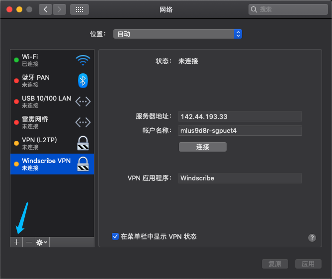
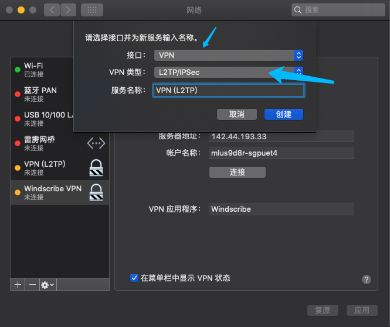
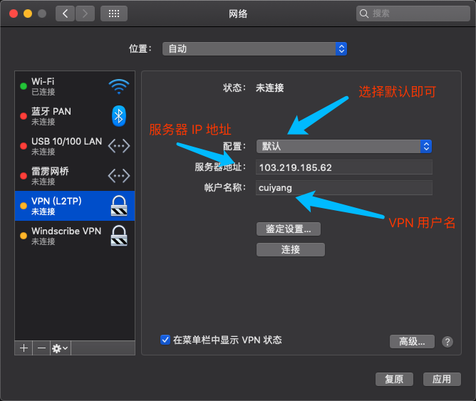
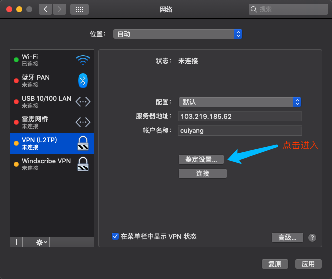
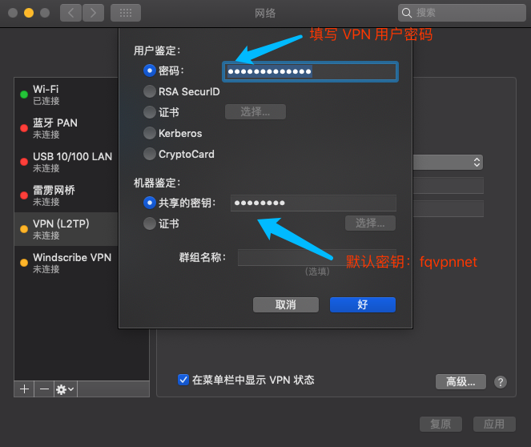
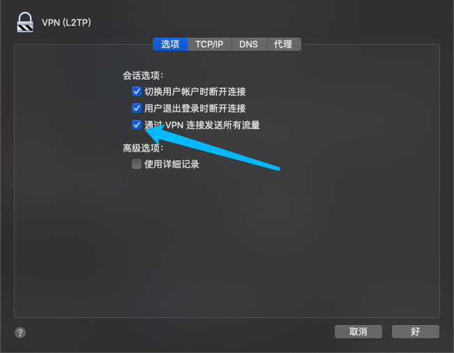
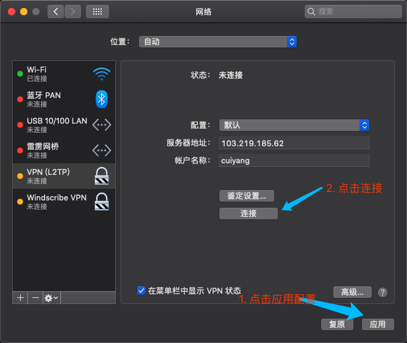

# Mac端创建 L2TP VPN 连接

>常见的，公司网络通常会分为内网(LAN)和外网（WAN）环境，也就是常说的局域网和广域网；外网 IP 是唯一的，内网 IP是由外网分配的，IP 是可以重复的。通常情况下，路由器或网关会对外网访问内网进行拦截，而内网访问外网是没有限制的，所以当我们想在家办公需要用到内网时，要通过 VPN 去连接， Mac 端不需要下载软件客户端即可连接

## 一、创建 L2TP 类型 VPN

1.进入“系统偏好设置”，点击左下角 “+” 号，开启创建交互窗口



2.选择接口、VPN 类型

提示：服务名称自定义即可



## 二、配置服务器、用户等信息

1.填写服务器地址和用户名



2.鉴定设置，填写服务器密码和共享秘钥

提示：默认密钥 *fqvpnnet*





## 三、高级设置

勾选 “通过 VPN 连接发送所有流量”


## 四、本地创建 options 文件

```bash
# 1. mac 终端或者 iterm2进入 etc/ppp目录
$ cd etc/ppp

# 2. vi 编辑创建 options 文件
$ vi options

# 3. 在 options 文件中编辑添加如下内容:
  plugin L2TP.ppp
  l2tpnoipsec

# 4. :wq 保存退出编辑

```

## 五、应用并连接测试

到这一步基本完成服务器、用户设置，然后点击应用、连接测试


